You may just want to use your Raspberry Pi to run some Linux scripts, build some projects, or maybe learn programming languages such as Python. But to do this you need to have a monitor, keyboard, mouse... etc. However, this will be associated with a huge amount of cost. 

### But !

You may use `Headless Setup` to use keyboard, mouse and monitor right from external PC for your Raspberry Pi to save the cost. So, let's get started.

## <a href="#format-sd">Format SD card to Raspbian</a>

If your SD card is not arrived with Raspbian or NOOBS pre-installed, you will need to format it first. 

For this tutorial, you will need to download two applications which is **Raspberry Pi Imager** and **Angry IP Scanner**.

 1. From your external PC, head over to [Raspberry Pi official download page](https://www.raspberrypi.org/software/) and choose the operating system of your external PC to download Raspberry Pi Imager. Then go to [Angry IP Scanner download page](https://angryip.org/download/) and select perating system of your external PC to download Angry IP Scanner.  

    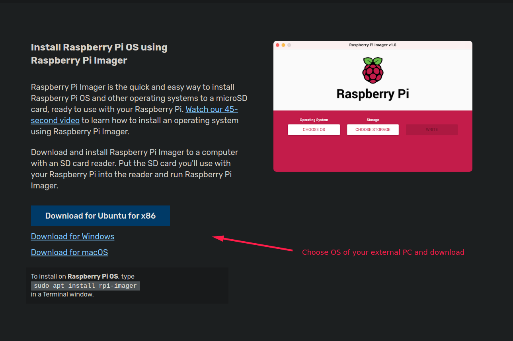

    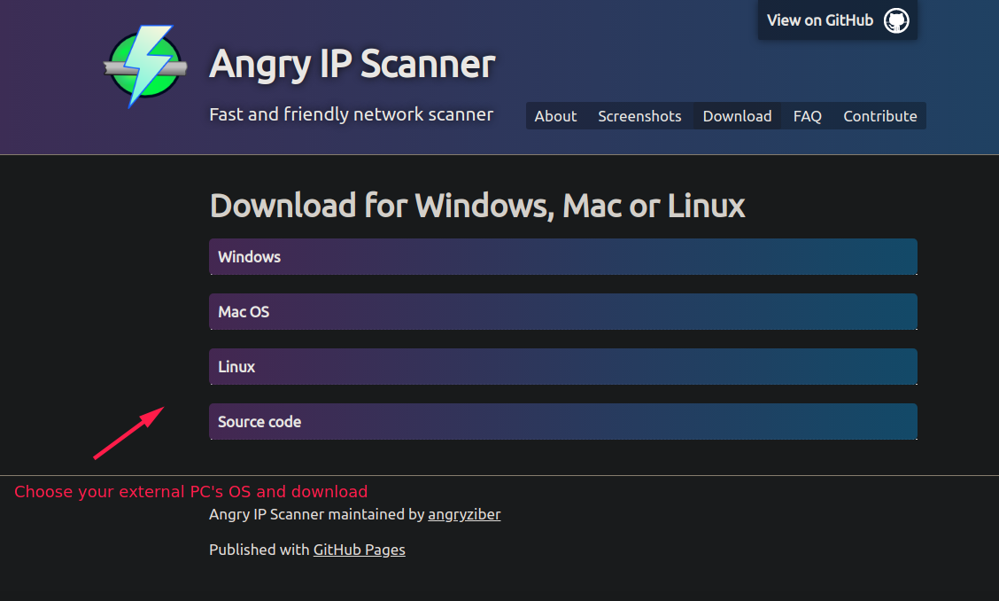
    

2. Insert your SD card to SD card slot or SD card reader of your **external PC**.

3. Open **Raspberry Pi Imager**. You will use this tool to format your Raspberry Pi SD Card.  

    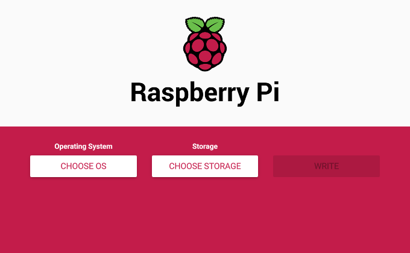
    

4. Click **CHOOSE OS**.  

    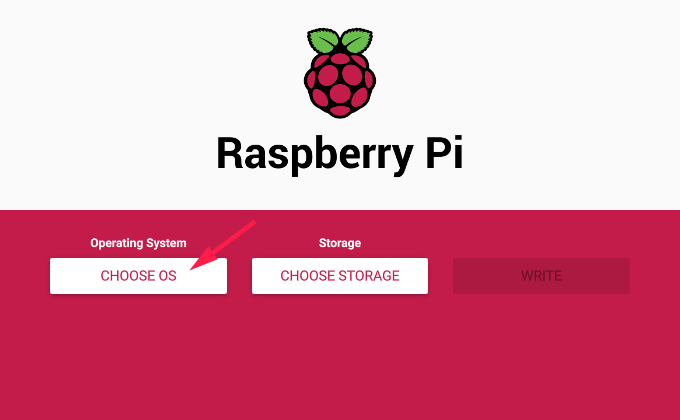 
    
    
5. <u>Here you will need to choose what OS you want to install on your Raspberry Pi. </u>
The first one in the list is the <u>**standard official Raspberry Pi OS (32-bit) image**</u>. It comes with the Raspberry Pi OS desktop environment and a **minimal number of software**. 
Click on Raspberry Pi OS (other) and you can see another two official image.
<u>**Raspberry Pi OS Lite (32-bit)**</u> image comes with only a limited number of programs and **no graphical desktop environment** . That means you will only work with Command-line interface in this image. 
Below it is  <u>**the full Raspberry Pi OS**</u> contains the **most commonly used apps/programs** and the Raspberry Pi OS graphical desktop environment. I recommend you to choose the full image only if your SD card comes with  **32GB storage** (the maximum storage to use on Raspberry Pi, you may use 64GB too with some tweaking) as it is **heaviest** in system resource and storage, otherwise, go back and choose **Raspberry Pi OS (32 bit)**.

    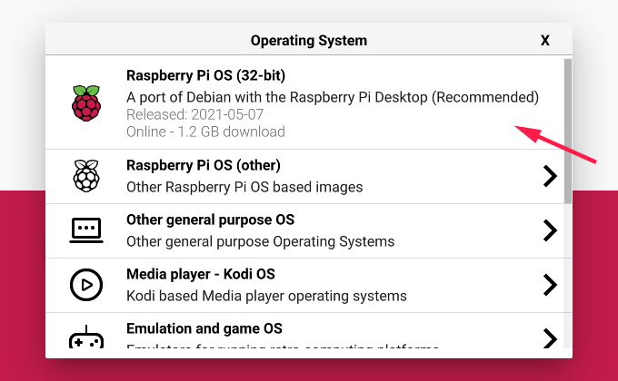
    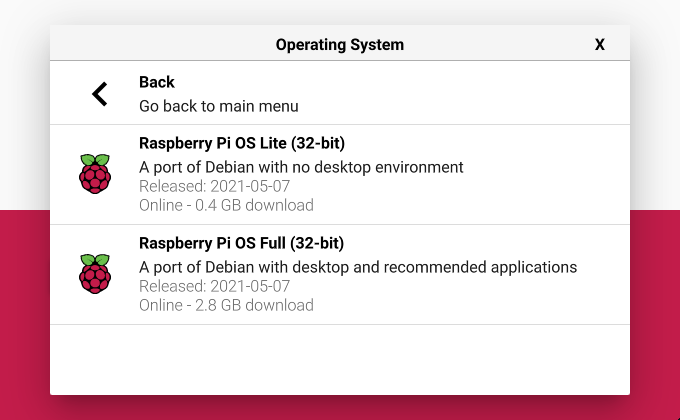
     
 6. Click **CHOOSE STORAGE**.
     
     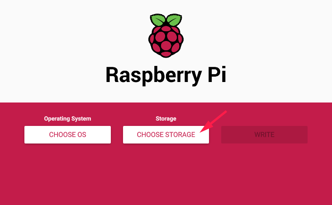 
     
     
 7. Choose the SD card you want to flash to your Raspberry Pi.
     
     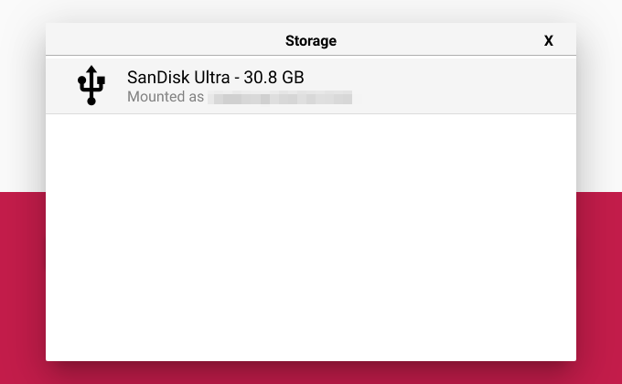 
     
     
 8. Now, press **Ctrl + Shift + X**. This should open a **Advanced options** dialog.
 9. Check **Enable SSH** and **Use password authentication**.
 10. Create a **login password** for your Raspberry Pi and fill it in the **Set password for 'pi' user** . You must remember it as we will need this password later for SSH login.
 11. If you are gonna to use WiFi for your Raspberry Pi's connection, check **Configure wifi** and configure your WiFi settings there. Otherwise, skip this step.
 12. Lastly, check **Set locale settings**. Choose your Time zone and Keyboard layout there and click **Save**.
     
     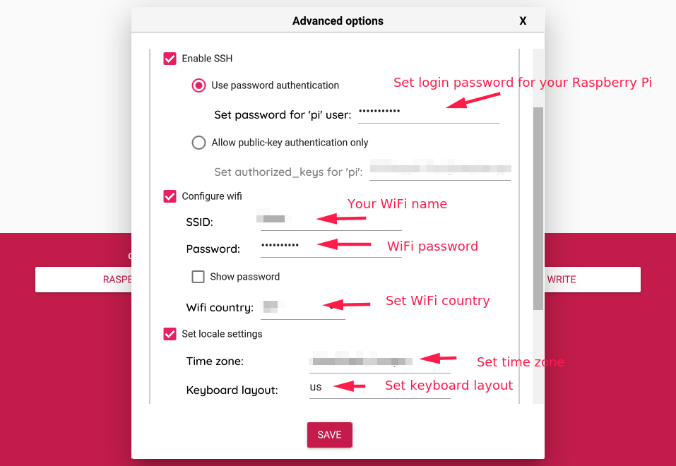 
     
     
 13. Finally, **check the OS and the Storage** configuration is correct and click **Write**. This will start writing the Raspberry Pi OS to the chosen SD Card. It might take a while so just have a coffee break. 
     
     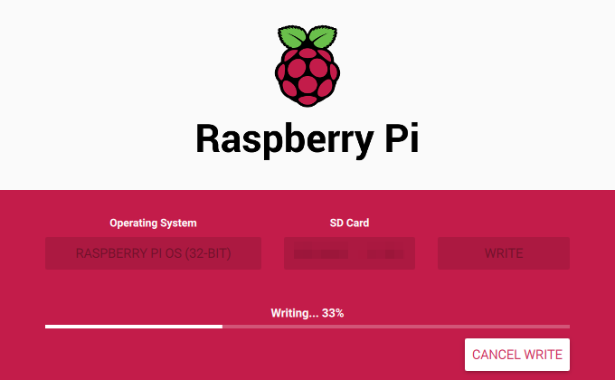
     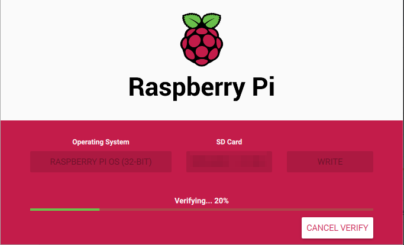 
     
     
### Errors? Writing time too long?

if you face errors, try this:

1. Terminate the writing process.
2. Head over to [Raspberry Pi OS download page](https://www.raspberrypi.org/software/operating-systems/) and download the Raspberry Pi OS you want.
     
     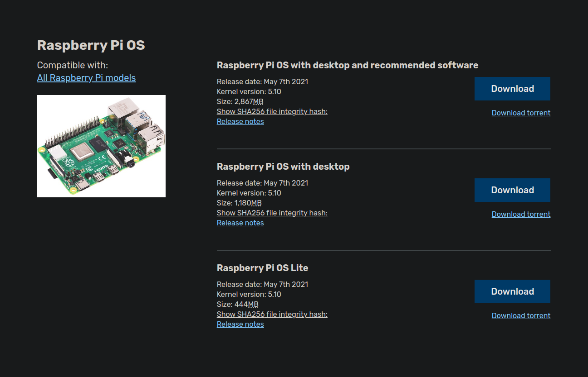
     
3. Relaunch Raspberry Pi Imager.
4. Click **CHOOSE OS**, scroll down and select **Use custom** . Choose the file you just downloaded.
5. Follow step 6 to 13 in Format SD card to Raspbian
